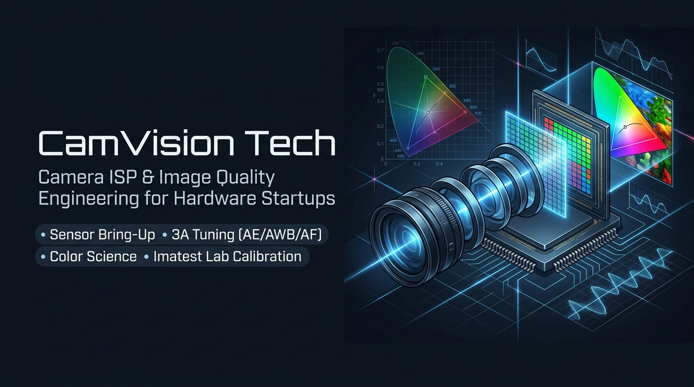

# CamVision Tech
### Embedded Camera & ISP Image Quality Engineering Studio

 

**Turn Raw Silicon Into Exceptional Visuals.**  
We optimize embedded camera pipelines, custom ISP registers, 3A algorithms, and low-light vision for robotics, IoT, automotive, and edge AI vision systems.

[Explore Live Demo](https://camvisiontech.github.io/ISP-Tuning/) • [Request $250 Quick IQ Triage](https://camvisiontech.github.io/ISP-Tuning/#pricing) • [Contact Engineering](mailto:contact.camvisiontech@gmail.com)

---

## 🎯 About CamVision Tech

Most hardware teams waste months wrestling with greenish sensor casts, blown-out dynamic range, motion blur ghosting, or high-noise camera feeds that cripple downstream computer vision models. 

**CamVision Tech** provides end-to-end ISP (Image Signal Processor) calibration and sensor bring-up engineering. From raw Bayer register dumps to production-grade 3A tuning and custom CCM color science, we transform uncalibrated camera modules into broadcast-quality vision pipelines.

👉 **Visit the live interactive website with Before/After comparison frames and instant diagnostic calculator:**  
🔗 **[https://camvisiontech.github.io/ISP-Tuning/](https://camvisiontech.github.io/ISP-Tuning/)**

---

## 🔬 Core Engineering Capabilities

### 1. RAW Sensor Bring-Up & Optical Calibration
- **Black Level Correction (BLC)**: Sub-pedestal black level calibration across temperatures and analog gain tiers.
- **Lens Shading Correction (LSC)**: Mesh-based luminance falloff correction and per-channel color shading calibration.
- **Defect Pixel Correction (DPC)**: Static dead-pixel mapping and dynamic high-gain defect interpolation.

### 2. 3A Algorithm Optimization (AE / AWB / AF)
- **Auto Exposure (AE)**: Multi-zone weighted metering, smooth convergence settling in `<300ms`, flicker avoidance (50Hz/60Hz).
- **Auto White Balance (AWB)**: Multi-illuminant locus calibration (D65, D50, CWF, TL84, Horizon, U30, Incandescent A). Elimination of sickly fluorescent green casts.
- **Auto Focus (AF)**: Contrast AF curve tuning and PDAF phase-detection calibration for fast focus locking.

### 3. Dynamic Range & HDR Fusion
- **Multi-Exposure HDR**: Staggered HDR, DCG (Dual Conversion Gain), and DOL-HDR multi-frame alignment.
- **Local Tone Mapping (LTM)**: Non-linear dynamic compression preserving shadow details while retaining highlight texture without halo artifacts.

### 4. Color Science & Custom CCM
- **Color Correction Matrix (CCM)**: Multi-illuminant 3x3 matrices tuned against X-Rite ColorChecker Digital SG for **$\Delta E_{00} < 1.8$** color fidelity.
- **Perceptual Tuning**: 3D LUT color grading for natural skin tones, foliage vibrancy, and realistic brand color reproduction.

### 5. Motion-Adaptive 2DNR / 3DNR Noise Filtering
- **Spatial & Temporal Denoising**: Bilateral 2D filtering combined with motion-vector-compensated 3DNR.
- **Compression Optimization**: Removes high-frequency sensor grain, yielding **up to 24% lower H.264/H.265 streaming bitrate** at equivalent perceptual quality.

### 6. Edge AI & Computer Vision Optimization
- Specialized tuning curves designed to preserve high-contrast edges and spatial gradients required by downstream **YOLO, SSD, and keypoint detection models**, boosting mean Average Precision (mAP).

---

## 🚀 Supported Platforms & Sensors

### Silicon & ISP Architectures
* **Qualcomm**: Spectra ISP / Chromatix Tuning Suite
* **Ambarella**: CV2x, CV5x, CV7x, A12, H22 Image Tool / ITuner
* **Rockchip**: RV1126, RV1109, RK3588, RK3568 (RKISP2 / RKISP1)
* **NVIDIA**: Jetson Orin / Xavier (Argus API & Libargus)
* **Raspberry Pi**: Broadcom / RP2040 / `libcamera` tuning files
* **Linux Embedded**: V4L2 subdev drivers and custom FPGA ISP pipelines

### Sensor Vendors
* **Sony Semiconductor**: Starvis / Starvis 2, Pregius, IMX series (e.g. IMX415, IMX485, IMX678, IMX715)
* **OmniVision**: OS08A20, OV48C, OV9281, OV2710, OG02B1B global shutter
* **ON Semiconductor / Aptina**: AR0821, AR0234, Hyperlux series
* **Samsung ISOCELL**: HM / GN series mobile & industrial sensors

---

## 💼 Engagement Options

| Tier | Turnaround | Deliverable |
|---|:---:|---|
| **Quick IQ Triage** | **24–48 Hours** | Sensor register audit, defect root cause report, and actionable register remedy plan ($250). |
| **Full Tuning Sprint** | **2 Weeks** | Complete end-to-end ISP calibration, register binary, and verified Imatest scorecard report. |
| **Production Bring-Up & Advisory** | **Ongoing** | Architecture selection, lens-sensor optical pairing, EVT to MP support, and factory calibration benches. |

---

## 📬 Contact & Inquiries

Ready to fix camera defects or bring up a new sensor module?

- **Direct Email**: [contact.camvisiontech@gmail.com](mailto:contact.camvisiontech@gmail.com)
- **Live Interactive Site**: [https://camvisiontech.github.io/ISP-Tuning/](https://camvisiontech.github.io/ISP-Tuning/)
- **LinkedIn**: [CamVision Tech Company Page](https://www.linkedin.com/company/camvision-tech/)

---

  Copyright &copy; 2026 CamVision Tech. All Rights Reserved.

